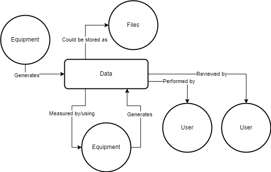

===========
Data Models
===========

The QuAAC specification has 5 data models:

* Document
* Data Point
* Equipment
* User
* Attachment

Each of these models represent one of the main components in a QA workflow.
The following flowchart shows how these models are related to each other:

Following the flowchart, the data models are described in detail below.

A piece of equipment generates some form of data and/or attachments (files).
Other equipment could be used to measure such data or to process it.
Sometimes, attachments are generated or created by the equipment itself to be processed by other ancillary equipment.
The data are performed by a user
and, ideally, reviewed by a user.

Models
------

The 5 QuAAC models are described in detail below.

.. automodule:: quaac.models
    :members:
    :show-inheritance:
    :exclude-members: model_computed_fields, serialize_performer, serialize_attachments, serialize_reviewer, serialize_primary_equipment, serialize_ancillary_equipment